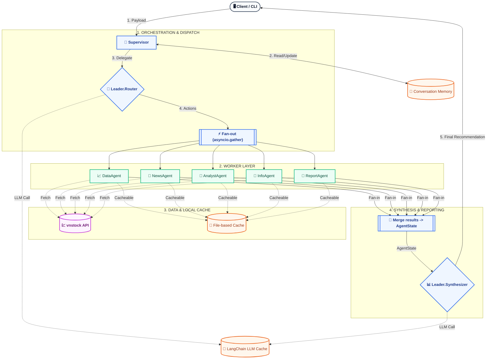

# 📊 Financial AI Agent Team System

Hệ thống multi-agent cho **phân tích chứng khoán Việt Nam** theo mô hình **Leader–Worker**, tập trung vào 3 điểm “ăn tiền” khi demo/đánh giá: **Stateful Memory**, **Parallel Execution**, **Smart Caching**.

## 1. Tổng Quan & Demo: Dự án giải quyết vấn đề gì?

### Bối cảnh bài toán
Phân tích 1 mã cổ phiếu ở Việt Nam thường không chỉ là “giá tăng/giảm”, mà là tổng hợp nhiều lát cắt:

- **Giá lịch sử (OHLCV)** để nhìn xu hướng/biến động
- **Tin tức + sentiment** để hiểu yếu tố tác động ngắn hạn
- **Chỉ báo kỹ thuật** (SMA/RSI/…)
- **Thông tin doanh nghiệp** (hồ sơ, ngành, quy mô, …)
- **Báo cáo tài chính / báo cáo phân tích** để có góc nhìn dài hạn

Cách làm truyền thống hay gặp 3 vấn đề:

1) Lấy dữ liệu theo từng bước **tuần tự** → thời gian chờ cộng dồn
2) Người dùng hỏi nhiều lượt → hệ thống **không nhớ ngữ cảnh** (ví dụ “cái này” là mã nào)
3) Query lặp lại → **tốn chi phí** và tạo độ trễ không cần thiết

### Demo nhanh
Chạy chế độ interactive để thấy rõ “memory” (multi-turn):

```bash
python -m src.fin_agent_team.cli --interactive
```

Ví dụ flow demo (một phiên hỏi đáp):

- Lượt 1: hỏi thông tin mã
- Lượt 2: hỏi tiếp “giá/technical/cái này…” → hệ thống vẫn hiểu đúng mã đang nói nhờ Conversation Memory

Ngoài interactive, có thể chạy 1 truy vấn đơn:

```bash
python -m src.fin_agent_team.cli --symbol VCB --query "VCB analysis"
```

## 2. Kiến Trúc Hệ Thống (High-level): Sơ đồ Leader–Worker

### Tổng quan luồng xử lý

- **Conversation Memory (stateful)**: lưu lịch sử lượt hỏi–đáp, entity (mã cổ phiếu, thời gian, ý định), giúp truy vấn sau kế thừa ngữ cảnh.
- **Supervisor**: điều phối toàn bộ pipeline.
- **Leader layer**:
  - **Router**: chọn “tối thiểu các tác vụ cần chạy” (data/news/analysis/info/report)
  - **Synthesizer**: tổng hợp kết quả thành câu trả lời cuối
- **Worker layer (5 agents)** chạy song song (parallel) để thu thập dữ liệu/insight.

Sơ đồ Mermaid (kiểu như ví dụ bạn gửi, phân biệt rõ **Supervisor** vs **Workers**):



### Output
Kết quả trả về theo dạng “báo cáo/khuyến nghị” đã được tổng hợp, thay vì chỉ dump dữ liệu thô.

## 3. Tính Năng Nổi Bật (Unique Selling Points)

### 3.1 Stateful Memory (Conversation Memory)

- **Vấn đề**: Người dùng thường hỏi theo kiểu hội thoại: “VCB thông tin?”, “giá sao?”, “kỹ thuật thế nào?”, “cái này có rủi ro gì?”
- **Giải pháp**: Conversation Memory lưu lịch sử + entities để:
  - nhận diện mã đang nói
  - kế thừa bối cảnh giữa các lượt
  - hỗ trợ load/save session (phục vụ demo hoặc chạy lâu)

Trong CLI có các lệnh phục vụ demo như `history`, `clear`, `save`, `status`.

### 3.2 Parallel Execution (chạy song song)

- **Vấn đề**: Nếu gọi lần lượt 5 tác vụ (giá → tin → chỉ báo → info → report) thì thời gian là tổng cộng từng bước.
- **Giải pháp**: Supervisor chạy các worker theo kiểu “fan-out/fan-in” bằng `asyncio.gather`, nên tổng thời gian gần bằng tác vụ lâu nhất.

Tác dụng thực tế khi demo: cảm giác hệ thống “nhanh” và “mượt” hơn đáng kể khi hỏi các câu cần nhiều nguồn.

### 3.3 Smart Caching (LLM + data)

Caching được bật ở 2 tầng chính:

- **LLM in-memory cache** (LangChain `InMemoryCache`): tránh gọi lại LLM cho prompt/đầu vào trùng.
- **File-based cache** (qua decorator/cache layer của project): cache kết quả các hàm lấy dữ liệu để giảm gọi lại nguồn dữ liệu và giảm độ trễ.

Mục tiêu: giảm query lặp, giảm chi phí API và tăng tốc độ phản hồi trong các vòng demo lặp lại.

## 4. Tech Stack

Bộ từ khóa/technology đúng theo repo hiện tại:

| Nhóm | Công nghệ | Mục đích |
|---|---|---|
| LLM orchestration | `langchain`, `langchain-core` | điều phối prompt/chain và tích hợp cache |
| OpenAI client | `langchain-openai` | gọi LLM qua `ChatOpenAI` |
| Async | `asyncio`, `aiohttp` | chạy song song + gọi network |
| Market data | `vnstock` | dữ liệu thị trường Việt Nam |
| Data processing | `pandas`, `numpy` | xử lý bảng dữ liệu, chỉ báo |
| NLP/Sentiment | `textblob` | sentiment từ tin tức |
| Env/secrets | `python-dotenv` | nạp `OPENAI_API_KEY` từ file `.env` (tùy chọn) |
| Other utilities | `requests`, `python-dateutil`, `sentence-transformers` | tiện ích/embedding (nếu dùng) |

Yêu cầu runtime: Python 3.9+ (khuyến nghị 3.10+).

## 5. Hướng Dẫn Cài Đặt (Quick Start)

### Bước 1: Tạo môi trường và cài dependencies

```bash
python -m venv venv
venv\Scripts\activate
pip install -r requirements.txt
```

### Bước 2: Thiết lập OpenAI API Key (không commit vào repo)

PowerShell (khuyến nghị cho phiên hiện tại):

```powershell
$env:OPENAI_API_KEY = "sk-..."
```

Hoặc tạo file `.env` ở root:

```text
OPENAI_API_KEY=sk-...
```

### Bước 3: Chạy demo

Interactive (multi-turn + memory):

```bash
python -m src.fin_agent_team.cli --interactive
```

Single query:

```bash
python -m src.fin_agent_team.cli --symbol VCB --query "VCB analysis"
```

### Bước 4: Verify project chạy thật (quan trọng)

```bash
python tests/test_full_workflow.py
```

## 6. Log / Vấn Đề Chưa Giải Quyết

- **2026-04-17 — Report (Báo cáo tài chính)**: Chưa làm trọn vẹn phần “report báo cáo tài chính” vì một số luồng lấy dữ liệu bị `vnstock` chặn/giới hạn truy cập (không truy vấn được BCTC theo kỳ như mong muốn).
    - **Hướng giải quyết khả thi**: tải dữ liệu về (offline dump) rồi ingest vào vector store (Milvus chạy trong Docker) để truy vấn theo ngữ nghĩa.
    - **Rủi ro/nhược điểm hiện tại**: dữ liệu BCTC theo nhiều mã × nhiều kỳ rất lớn → tốn tài nguyên (storage + embedding) và khi query dễ **retrieval thiếu/nhầm kỳ**, dẫn tới câu trả lời **sai** hoặc “lẫn số liệu”. Vì vậy, nếu đi theo hướng Milvus cần chiến lược phân vùng + lọc metadata theo mã/kỳ, và/hoặc tách phần số liệu dạng bảng sang storage có cấu trúc (SQL), Milvus chỉ giữ narrative/summarized text.
